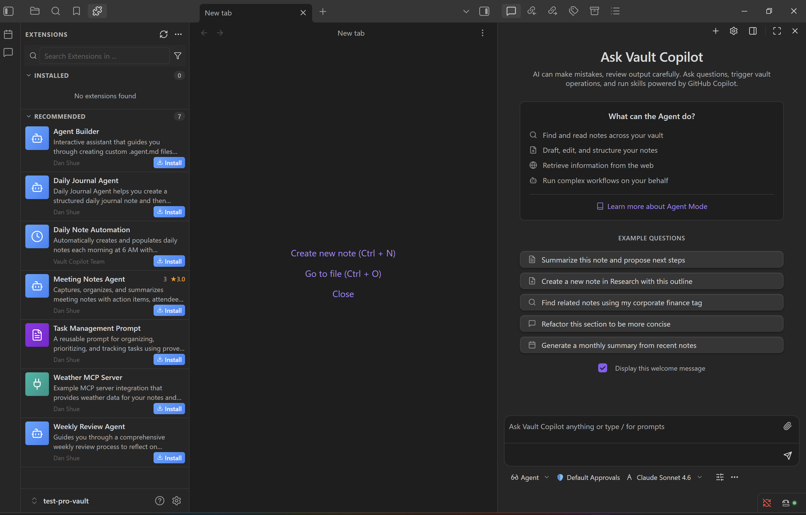

# Vault Copilot Pro

Vault Copilot Pro is an unofficial Obsidian plugin that brings AI-powered assistance to your entire vault. It uses the GitHub Copilot CLI SDK as its foundation, which allows the plugin to communicate with your GitHub Copilot account and execute advanced operations through a skill-based architecture.

Vault Copilot Pro is more than a simple bridge to your notes. It provides custom agents, agentic workflows, and automations that let the AI interact with your Obsidian workspace — searching notes, reading and modifying content, generating new files, organizing information, and orchestrating multi-step operations across your vault. Define agents, prompts, and automations entirely in Markdown files with no code required.

The plugin is built for extensibility. It supports Model Context Protocol (MCP), an extension marketplace, and a skill registry that allows developers to expose their own tools, APIs, commands, or workflows. Third-party Obsidian plugins can also register their own capabilities, allowing the AI to interact with features provided by other plugins.

With this foundation, Vault Copilot Pro becomes a flexible reasoning and automation layer inside Obsidian. You can ask questions, draft or rewrite content, trigger vault operations, run scheduled automations, coordinate multi-agent workflows, and extend the system with your own tooling as your needs grow.

Vault Copilot Pro is a community project and is not affiliated with, sponsored by, or endorsed by Microsoft or GitHub. An active GitHub Copilot subscription is required when using GitHub Copilot as the AI provider. Alternative providers (OpenAI, Azure OpenAI) are also supported.



*The screenshot shows Vault Copilot Pro in action. The chat interface allows you to converse with Vault Copilot Pro, attach notes for context, give it commands against your vault, and receive streaming responses.*

## Features

### AI-Powered Chat
Have natural conversations with AI directly inside Obsidian. Ask questions, explore ideas, analyze content, and draft or rewrite text using a conversational interface with streaming responses.

### Note Context Attachment
Attach notes to a conversation so the model can use their content for more accurate and context-aware responses. Useful for research, documentation, journaling, or large project work.

### Vault Integration
Vault Copilot Pro can read, search, create, modify, and organize notes inside your vault. Over 35 built-in tools give the AI structured access to vault operations including note management, task tracking, web search, and file organization.

### Custom Agents
Define specialized AI agents in `.agent.md` Markdown files — no code required. Each agent has its own instructions, personality, allowed tools, and model preferences defined in YAML frontmatter. Select agents from a dropdown in the chat interface, or let agents hand off to each other during a conversation.

```yaml
---
name: Research Assistant
description: Finds and synthesizes information from vault and web
tools: [batch_read_notes, search_notes, web_search, fetch_web_page]
model: gpt-4.1
---
You are a research assistant. When asked about a topic, search the vault first,
then supplement with web sources. Always cite your sources.
```

Agents support handoffs, tool allowlists, model overrides, and custom instructions. See the [Workflow Design Guide](docs/WORKFLOW-DESIGN.md) for the full configuration reference.

### Agentic Workflows
Vault Copilot Pro supports 10 composable orchestration patterns that can be mixed and nested to build sophisticated workflows:

| Pattern | Description |
|---------|-------------|
| **Single Agent + Tools** | One agent with access to structured tools |
| **Sequential Pipeline** | Chain agents where each step feeds output to the next |
| **Manager/Planner** | A planner agent decomposes goals into subtasks and delegates to specialist agents |
| **Parallel Execution** | Run multiple independent agents concurrently with bounded session pools |
| **Agent Handoffs** | One-to-one specialist delegation with conversation context |
| **Group Discussion** | Multi-agent collaboration with round-robin or moderator-directed strategies |
| **Human-in-the-Loop** | Tool approval prompts and approval gates for sensitive operations |
| **Guardrails** | Input/output validation (regex or LLM-based) with pass, block, or transform verdicts |
| **Durable Workflows** | Checkpoint-resume architecture with retry and exponential backoff for multi-day workflows |
| **Session-Based Assistant** | Persistent working memory across conversation turns |

Workflows pass data between steps using template placeholders (`{{previousOutput}}`, `{{stage[N].output}}`, `{{input.key}}`). The Manager/Planner pattern includes quality evaluation loops that can replan when results are insufficient.

For full documentation, pattern details, and real-world recipes, see the [Workflow Design Guide](docs/WORKFLOW-DESIGN.md) and the [Team Captain Workflow Example](docs/TEAM-CAPTAIN-WORKFLOW-EXAMPLE.md).

### Automations
Define scheduled or event-triggered workflows in `.automation.md` Markdown files. Automations run agents, prompts, skills, or pipelines on a schedule or in response to vault events — no code required.

**Trigger types:**
- **Schedule** — Cron expressions (e.g., `0 9 * * 1-5` for weekdays at 9 AM)
- **File events** — File created, modified, or deleted matching a glob pattern
- **Tag added** — When a specific tag is added to a note
- **Vault opened** — When the vault is opened
- **Startup** — When the plugin loads

**Action types:**
- `run-agent` — Execute an agent with input
- `run-prompt` — Execute a saved prompt
- `run-skill` — Execute a registered skill
- `run-pipeline` — Execute a sequential pipeline with optional synthesis
- `approval-gate` — Pause for human approval before continuing
- `conditional` — Branch based on result of a previous step
- `parallel` — Run multiple actions concurrently
- `wait-for` — Pause until an external condition is met (file exists, HTTP endpoint, expression)
- `wait-duration` — Pause for a fixed time period
- `notify` — Send a notification

Automations support durable checkpoint-resume, so workflows survive app restarts and can span multiple days. Retry policies with exponential backoff and jitter provide fault tolerance for unreliable operations.

```yaml
---
name: Daily Planning Brief
enabled: true
triggers:
  - type: schedule
    schedule: "0 9 * * 1-5"
actions:
  - type: run-agent
    agentId: daily-planner
    input:
      focus: "Review calendar, check pending tasks, draft today's priorities"
---
```

### Custom Prompts
Save reusable prompt templates in `.prompt.md` files. Access them from a slash-command picker in the chat input by typing `/` followed by the prompt name. Prompts support variable substitution (`{{variable}}`), model overrides, agent assignment, and tool declarations.

```yaml
---
name: Research Pipeline
description: "3-stage pipeline: Research → Draft → Review"
tools: [run_pipeline, web_search, fetch_web_page]
model: gpt-4.1
argumentHint: "topic to research"
---
Run a sequential pipeline to research {{topic}} and produce a polished note.
```

### Voice Agents
Talk to your vault with real-time voice conversation powered by the OpenAI Realtime API. Voice agents listen, respond in natural speech, and can execute tools hands-free.

- **Built-in specialist agents** — Note Manager, Task Manager, and WorkIQ (Microsoft 365 integration)
- **Custom voice agents** — Define your own in `.voice-agent.md` files with custom instructions, tool access, and voice selection
- **Agent handoffs** — Say "switch to notes" or "check my calendar" to transfer between voice agents
- **Voice selection** — Choose from multiple voice characters (alloy, nova, echo, sage, and more)
- **Transcription backends** — OpenAI Whisper, Azure Speech, or local whisper.cpp for offline transcription

### Copilot Agent Skills
Vault Copilot Pro supports GitHub Copilot Agent Skills — folder-based skill definitions that teach Copilot how to perform specialized tasks in a specific and repeatable way. Skills contain instructions, scripts, templates, and resources that Copilot loads when the content matches your prompt.

In Obsidian, you can create skills that describe how your notes are organized, how you structure writing projects, or how you want information reformatted. Copilot loads the skill instructions and applies them to your vault, maintaining your personal style and structure. Skills work across the Copilot coding agent, Copilot CLI, and agent mode in VS Code.

### Extensible Skills System
Vault Copilot Pro exposes a skill registry that allows third-party Obsidian plugins to register custom tools. Registered skills appear in settings and are automatically discovered by the AI. Skills support parameter schemas, confirmation prompts, and categories (notes, search, automation, integration, utility, custom).

### Extension Marketplace
Discover, install, and manage community-contributed extensions from within the plugin. Extensions can package any combination of:
- **Agents** and **voice agents**
- **Prompts** and **skills**
- **MCP server configurations**
- **Automations**

The marketplace supports version management, update notifications, community ratings, and in-app submission for extension authors.

### Model Context Protocol (MCP) Support
Integrate additional tools, APIs, and external systems into Vault Copilot Pro through MCP. Two transport types are supported:

- **Stdio** (desktop only) — Spawns a local MCP server process. Supports companion processes for OAuth authentication sidecars.
- **HTTP/SSE** (cross-platform) — Connects to remote MCP servers over HTTP/HTTPS. Works on both desktop and mobile.

Vault Copilot Pro auto-discovers MCP server configurations from Claude Desktop, VS Code, Cursor, GitHub Copilot CLI, and per-vault `.obsidian/mcp.json` files. Tools from all connected MCP servers are available uniformly to all AI providers.

### Multiple AI Providers & Models
Choose your preferred AI provider:

| Provider | Requirements | Platforms |
|----------|-------------|-----------|
| **GitHub Copilot** (default) | Copilot subscription + CLI | Desktop |
| **OpenAI** | OpenAI API key | Desktop & Mobile |
| **Azure OpenAI** | Azure OpenAI resource + API key | Desktop & Mobile |

Each provider supports streaming chat completions, tool/function calling, and MCP tool integration. Select from available models including GPT-4.1, GPT-4o, Claude, Gemini, o1, o3-mini, and others. Switch providers anytime in **Settings → Chat Preferences**.

### Powered by the GitHub Copilot CLI SDK
Built on top of the GitHub Copilot CLI SDK, Vault Copilot Pro supports advanced capabilities such as:
- Secure execution of structured commands
- Parameterized and typed tools the model can reliably call
- Context-aware tool selection and multi-step reasoning
- Automatic parsing of arguments, paths, and note operations
- Improved agent behavior due to the SDK's tool invocation framework

This makes Vault Copilot Pro more predictable, more capable, and safer than traditional prompt-only approaches.


## Requirements

- **GitHub Copilot subscription** (Individual, Business, or Enterprise) — required when using GitHub Copilot as the AI provider
- **GitHub Copilot CLI** installed and authenticated — required for the GitHub Copilot provider
- **Desktop only** for the GitHub Copilot provider (not compatible with Obsidian Mobile)
- **OpenAI or Azure OpenAI API key** — required when using alternative AI providers (these work on both desktop and mobile)
- **OpenAI API key** — additionally required for Voice Agent features (uses OpenAI Realtime API)

## Beta Testers

Want to test Vault Copilot Pro before it's available in the Obsidian Community Plugin directory? You can install the plugin directly from GitHub using the **BRAT** (Beta Reviewers Auto-update Tool) Obsidian plugin.

BRAT allows you to install and automatically update beta plugins from GitHub repositories. Once configured, you'll receive updates as soon as new versions are released.

### Quick install with BRAT

1. Install the [BRAT plugin](https://github.com/TfTHacker/obsidian42-brat) from the Obsidian Community Plugin directory
2. Open **Settings → BRAT → Add Beta Plugin**
3. Enter the repository URL: `danielshue/obsidian-vault-copilot-pro`
4. Enable the plugin in **Settings → Community Plugins**

## Developers

Vault Copilot Pro provides an extensible API for third-party Obsidian plugins. You can:

- **Register Skills**: Define custom tools that the AI assistant can invoke on behalf of users
- **Configure MCP Servers**: Add Model Context Protocol servers to extend capabilities
- **Listen to Events**: React to skill registration changes in real-time
- **Submit Extensions**: Package and publish agents, prompts, skills, automations, or MCP configs to the extension marketplace

Registered skills appear in the Vault Copilot Pro settings panel, and the AI automatically discovers and uses them when relevant to user requests.

See the contributor workflow in [CONTRIBUTING.md](CONTRIBUTING.md) and working examples in the test vault.

## Contributing
Contributions are welcome! Please read our Contributing Guide for details on our code of conduct and the process for submitting pull requests.

## License
This project is licensed under the [MIT](https://danielshue.github.io/obsidian-vault-copilot/LICENSE) License - see the LICENSE file for details.

## Acknowledgments
Built with GitHub Copilot CLI and GitHub Copilot CLI SDK

## Author
Dan Shue - [GitHub](https://github.com/danielshue)